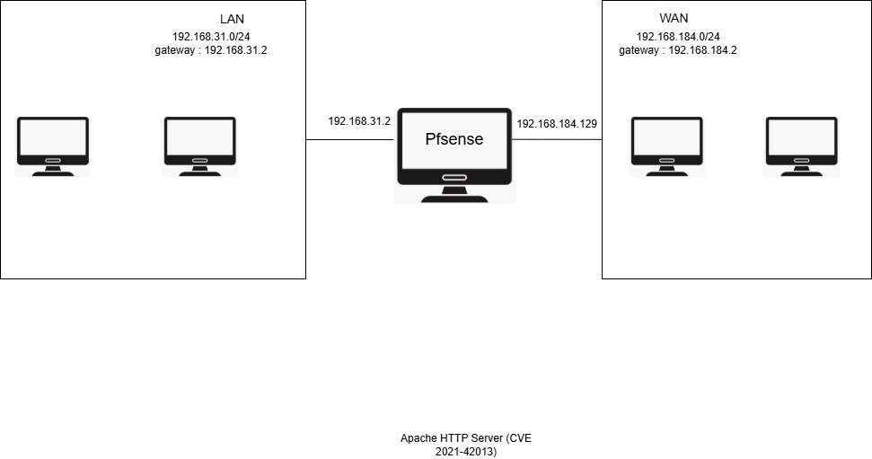
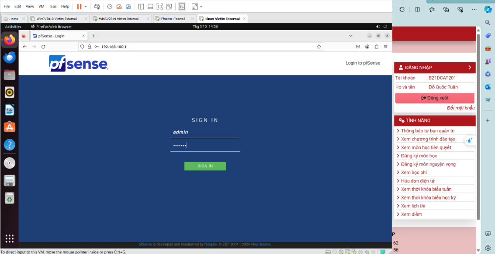

# 🧪 Lab Guide – Pfsense Firewall Lab

## 1. Mục tiêu
- Xây dựng mô hình mạng doanh nghiệp gồm 2 subnet **Internal** và **External**.
- Cài đặt và cấu hình **pfSense Firewall**.
- Kiểm tra kết nối, triển khai **firewall rule** và **port forwarding**.

---

## 2. Chuẩn bị môi trường
- **Phần mềm:** VMware Workstation / VirtualBox  
- **Máy ảo sử dụng:**
  - pfSense Firewall
  - Kali Linux (Internal & External)
  - Windows Server (Internal & External)
  - Ubuntu (Internal)

---

## 3. Cấu hình mạng
### 3.1 Topology
Mô hình mạng được triển khai trên VMware:  



### 3.2 Subnet
- **External:** `10.10.19.0/24` (vmnet11)  
- **Internal:** `192.168.100.0/24` (vmnet10)  

### 3.3 Địa chỉ IP mẫu
| Máy ảo              | Interface | IP Address        |
|---------------------|-----------|------------------|
| pfSense (WAN)       | External  | 10.10.19.1       |
| pfSense (LAN)       | Internal  | 192.168.100.1    |
| Windows Server Ext  | External  | 10.10.19.202     |
| Windows Server Int  | Internal  | 192.168.100.201  |
| Ubuntu Internal     | Internal  | 192.168.100.147  |
| Kali External       | External  | DHCP / Static    |
| Kali Internal       | Internal  | DHCP / Static    |

---

## 4. Cài đặt pfSense
1. Khởi động máy ảo pfSense → chọn **Install**.  
   

2. Gán card mạng:  
   - **WAN** → External (10.10.19.0/24)  
   - **LAN** → Internal (192.168.100.0/24)  

3. Sau khi cài đặt, truy cập pfSense qua **Web GUI** tại:  
   - `http://192.168.100.1`  
   - User: `admin` / Pass: `pfsense`  

   

---

## 5. Kiểm tra kết nối
- **Internal:** Ping giữa Windows, Ubuntu, Kali.  
  

- **External:** Ping giữa Windows và Kali.  
  

- **Qua pfSense:** Ping từ pfSense tới Internal & External.  
  

---

## 6. Cấu hình Firewall Rule (ICMP)
1. Vào **Firewall → Rules**.  
   

2. Thêm rule cho phép **ICMP từ External → WAN pfSense (10.10.19.1)**.  
   

3. Apply changes và kiểm tra:  
   

---

## 7. Port Forwarding (SSH)
1. Vào **Firewall → NAT → Port Forward**.  
   

2. Thêm rule:  
   - Interface: WAN  
   - Protocol: TCP  
   - Destination: WAN Address  
   - Destination Port: 22  
   - Redirect target IP: `192.168.100.147` (Ubuntu)  
   - Redirect target port: 22  

   

3. Apply changes → kiểm tra bằng:  
   ```bash
   ssh user@10.10.19.1


 ## Cấu hình Topo mạng
 Tạo thêm 2 Subnet trên Vmware vmnet11 có địa chỉ 10.10.19.0/24 cho mạng External và vmnet10 có địa chỉ 192.168.100.0/24 cho mạng Internal.
 
 
 
 
 
 
 
 
 
 
 
 
 
 
 
 
 
 
 
 
 
 
 
 
 
 
 

 
 
 


